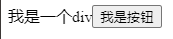

# JSX（JavaScript Syntax Extension）

基本概念： JSX 是 JavaScript 的语法扩展。JSX 允许你使用类似于 HTML 的形式去编写 JS, 在 React 中，它是声明式编程的具体体现 --> i.e. 结果导向

转换：JSX 就是`React.createElement()`的语法糖，JSX 在执行前会被 babel 转译为 JS 以调用`React.createElement() `

例如

```html
<h1>Hello</h1>
```

在背后会被 babel 转换为

```js
React.createElement("h1", null, "Hello");
```

## 创建 React 元素的两种方式

```js
//命令式编程：
const button = React.createElement("button", {}, "我是按钮");

//声明式编程（使用JSX）：
const button = <button>我是按钮</button>; // 与上面的命令式编程效果相同。
```

这两种方式的效果是完全相同。声明式编程的优点在于它是结果导向，i.e. 关注最终的效果，而不是达到这个效果的过程

## JSX 转换

为了让浏览器和 React 能够理解 JSX，需要将其转换为纯 JavaScript。这个过程需要使用 `Babel` 这个库来完成

示例代码：[../script/04-JSX-basics-p1.html](../script/04-JSX-basics-p1.html)



例如，用 JSX 创建一个带有按钮的 div:

1. 首先，需要在 HTML 文件中引入 `Babel` 库

   ```html
   <script src="https://cdnjs.cloudflare.com/ajax/libs/babel-standalone/6.26.0/babel.min.  js"></script>
   ```

2. 然后，编写 JSX 代码，注意需要在 `<script>` 标签中添加 `type = "text/babel"` 属性，这样 `Babel` 库才会将下面的代码翻译为纯 JavaScript

   ```js
   <script type="text/babel">  // <!--设置js代码被babel转译-->
       const div = (
           <div>
               我是一个div
               <button>我是按钮</button>
           </div>
       );

       // 等效于:
       // const div = React.createElement('div', {}, '我是一个div', React.createElement    ('button',{}, '我是按钮'));

       // 最后将 div 元素渲染到页面上：
       const root = ReactDOM.createRoot(document.getElementById("root"));
       root.render(div);
   </script>
   ```
