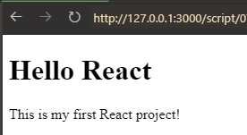

# 创建 React 项目（手动）

示例：[../script/07-create-react-project/](../script/07-create-react-project/)

## 项目结构

React 开发中，通常使用`npm` 或 `yarn`作为包管理器来对项目进行管理。并且 React 官方出于便利的考虑为开发者提供了`react-scripts`包。这个包中含有大部分开发中需要的依赖，极大地简化了项目开发流程

常规项目目录结构：

```sh
根目录/
│
├── public/
│   └── index.html  # 作为应用的入口HTML文件, （添加标签 <div id="root"></div>）
│
└── src/
    ├── App.js      # 主应用组件
    └── index.js   # 项目入口文件
```

## 开发步骤

1. 创建上述项目目录
2. 进入项目，执行以下命令初始化项目
   ```sh
    npm init -y
    #或
    yarn init -y
   ```
3. 安装必要的项目依赖
   ```sh
   npm install react react-dom react-scripts -S # 分别引用了react、react-dom、react-scripts 三个包
   # 或者
   yarn add react react-dom react-scripts
   ```
4. 运行项目

   - 可以使用以下命令直接启动
     ```sh
     npx react-scripts start
     ```
   - 也可以在`package.json`中添加`scripts`字段，然后使用`npm run start`启动

     ```json
     {
        "scripts": {
           "start": "react-scripts start"
           "build": "react-scripts build"
           ...
        }
     }
     ```

     注意：如果用 `npm build`命令， 需要把./build/index.html 中的

     `<script src="/static/js/main.0e3e0e0e.chunk.js"></script>`改为

     `<script src="./static/js/main.0e3e0e0e.chunk.js"></script>` 才能正常运行，
     因为`/`表示根目录，而`./`表示当前目录

## 文件内容

```sh
├── public/
│   └── index.html
├── src/
│   ├── App.js
│   └── index.js
```

./public/index.html

```html
<!--public/index.html是首页的模板，webpack打包时会将src/index.js打包到public/index.html中的root标签中 -->

<!DOCTYPE html>
<html lang="en">
  <head>
    <meta charset="UTF-8" />
    <meta name="viewport" content="width=device-width, initial-scale=1.0" />
    <title>Document</title>
  </head>
  <body>
    <div id="root"></div>
  </body>
</html>
```

./src/App.js

```js
// App.js是主应用组件，作用是渲染页面内容
const app = (
  <div>
    <h1>Hello React</h1>
    <p>This is my first React project!</p>
  </div>
);

export default app;
```

./src/index.js

```js
// index.js 是整个项目的入口文件，它的作用是将 App 组件渲染到 index.html 中的 root 节点上

// 引入ReactDOM
import ReactDOM from "react-dom/client";
import app from "./App";

// 将 app组件渲染到页面上
const root = ReactDOM.createRoot(document.getElementById("root"));
root.render(app);
```


