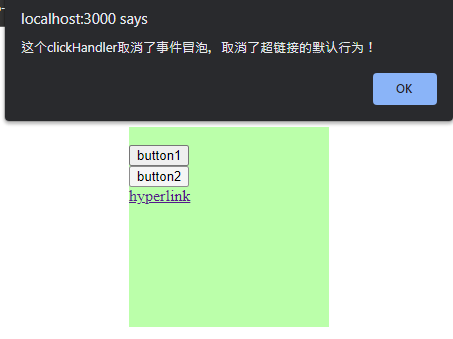

# 事件

React 中的事件绑定和 DOM 中的事件绑定类似, 但是有一些语法上的不同

示例：[../script/09-event-handling/App.js](../script/09-event-handling/App.js)



### 传统 DOM 中的事件绑定:

```js
<button onclick="alert('你点我干嘛');">点我一下</button

// 在HTML中，onclick全都小写
// 它的值是一组JS代码，当事件触发时，JS代码便会执行
```

### React 中的事件绑定:

1. React 中的事件绑定是驼峰命名法

```
  onclick -> onClick
  onchange -> onChange
```

2. React 的事件属性值<u>**不能直接执行代码**</u>，需要传入一个函数（回调函数）

例 1：

```js
// 错误写法
// <button onClick={alert('Hello')}>按钮</button> // 属性值不能直接执行代码

// 正确写法
<button onClick={() => alert("Hello")}>按钮</button> // 需要传入一个回调函数
```

例 2：

```js
// 定义一个clickHandler
const clickHandler = () => {
  alert("Hello");
};

// 错误写法
<button onClick={clickHandler()}>按钮</button> // clickHandler()传入的是一个函数的执行结果, 会在页面加载完成后立即执行

// 正确写法
<button onClick={clickHandler}>按钮</button>; // clickHandler传入的是一个函数, 会在事件触发（点击按钮）时执行

/*
 * 上例中的 `clickHandler` 不能加（），加（）就会直接执行函数，而不是绑定事件
 * 这里需要传入的是一个函数，而不是一个函数的执行结果
 *
 * 特殊例子：假如函数的返回值也是一个函数，那么就需要加（）了
 */
```

# 事件对象

- React 事件也会产生事件对象，在事件的响应函数中可以定义第一个参数来获取事件对象

  ```js
  function handleClick(event) {
    console.log(event.type); // 输出: "click"
  }
  return <button onClick={handleClick}>点击我</button>;
  ```

- React 中的事件对象同样不是原生的事件对象，是经过 React 包装后的事件对象
- 由于对象进行过包装，所以使用过程中我们无需再去考虑兼容性问题
  ```js
  const clickHandler = (e) => {
    e.preventDefault(); // 取消默认行为
    e.stopPropagation(); // 取消事件的传播
    // 其他代码
  };
  ```
