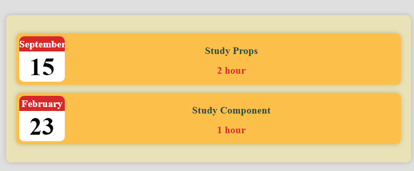

# props

示例：[../script/10-props/](../script/10-props/)



props = properties， 是组件间通信的一种机制，类似于函数的参数

在父组件中可以直接在子组件中设置属性来传递参数：

```js
// App.js: 这是一个父组件，定义了三个 Person 子组件，并给每个子组件传递了 name 和 age 属性

// App.js
import React from "react";
import "./App.css";
import Person from "./Person/Person";

function App() {
  return (
    <div className="App">
      <h1>Hi, I'm a React App</h1>

      <Person name="Max" age="28" />
      <Person name="Manu" age="29" />
      <Person name="Stephanie" age="26" />
    </div>
  );
}

export default App;
// 输出结果

// Hi, I'm a React App
// I'm Max and I am 28 years old!
// I'm Manu and I am 29 years old!
// I'm Stephanie and I am 26 years old!
```

```js
// Person.js : 接受 props 作为参数并返回一段 JSX 代码

import React from "react";

const person = (props) => {
  return (
    <div>
      <p>
        I'm {props.name} and I am {props.age} years old!
      </p>
    </div>
  );
};

export default person;
```

## 简化代码

一般来说数据是从数据库或者服务器获取的，不会直接写在代码中

假设现在有一个数组，包含了 3 个对象，每个对象都有 4 个属性，分别是id、name、age、hobbies

```js
const data [
    {id: 01, name: 'Max', age: 28, hobbies: 'Racing'},
    {id: 02, name: 'Manu', age: 29, hobbies: 'Climbing'},
    {id: 03, name: 'Stephanie', age: 26, hobbies: 'Coding'}
]
```

现在可以使用`map()`方发创建`<Person />`组件，然后将`data`数组中的每个对象的 id、name、age、hobbies 属性传递给<Person />组件， 这样就可以动态地渲染出多个`<Person />`组件了

> 关于`map()`方法的使用，可以参考[./05-rendering-list.md](./05-rendering-list.md) 以及[../JS-basics/07-arrary.md](../JS-basics/07-arrary.md)

```js
// App.js
const personData = data.map(item => {
    return <Person key={item.id} name={item.name} age={item.age} hobbies={item.hobbies} />
}

// 相当于
// <Person key={data[0].id} name={data[0].name} age={data[0].age} hobbies={data[0].hobbies} />
// <Person key={data[1].id} name={data[1].name} age={data[1].age} hobbies={data[1].hobbies} />
// <Person key={data[2].id} name={data[2].name} age={data[2].age} hobbies={data[2].hobbies} />

// 然后在App组件中，只需要插入personData数组，代码更加简洁清晰
const App = () => {
    return (
        <div className="App">
            {personData}
        </div>
    );
}
```

```js
// Person.js  接受 props 作为参数
const person = (props) => {
  return (
    <div>
      <p>
        I'm {props.name} and I am {props.age} years old! My hobbies are{" "}
        {props.hobbies}
      </p>
    </div>
  );
};

export default person;
```

## props 的注意事项
1. props是只读的，不能在子组件中修改props
2. 解构props，可以简化代码
    ```js
    // Person.js

    import React from 'react';

    const person = ({name, age}) => {
        return (
            <div>
                <p>I'm {name} and I am {age} years old!</p>
            </div>
        )
    };

    export default person;
    ```
3. 标签体的内容可以通过 `props.children` 来访问

   ```js
    // App.js

    import React from 'react';
    import './App.css';
    import Person from './Person/Person';

    function App() {
        return (
            <div className="App">
                <Person name="Manu" age="29" />
                <Person name="Stephanie" age="26" >My Hobbies: Coding</Person>
            </div>
        );
    }

    export default App;

    // 输出结果

    /*
        I'm Manu and I am 29 years old!

        I'm Stephanie and I am 26 years old!
        My Hobbies: Coding

    * 对于 Manu，这里没有提供任何标签体内容，所以这个<p>标签是空的
    * 对于 Stephanie，这里显示了我们在 Person 组件中定义的标签体内容
    */
    ```
    ```js
    // Person.js

    import React from 'react';

    const person = ({name, age, children}) => {
        return (
            <div>
                <p>I'm {name} and I am {age} years old!</p>
                <p>{children}</p>
            </div>
        )
    };

    export default person;
    ```

# 设置日期
1. 创建日期对象：可以使用 `Date` 构造函数来创建日期对象
   ```js
   const date = new Date();  // 当前日期和时间

   /*
    * 无参数 -> 返回当前日期和时间
    * 一个整数 -> 从 1970 年 1 月 1 日开始经过的毫秒数
        比如 new Date(1000) 表示 1970 年 1 月 1 日 00:00:01
    * 一个字符串 -> 日期字符串
        比如 new Date('2021-03-19') 表示 2021 年 3 月 19 日 00:00:00
    * 多个整数 -> 年、月、日、时、分、秒、毫秒
        比如 new Date(2021, 2, 19, 12, 30, 30, 500) 表示 2021 年 3 月 19 日 12:30:30.500
    */
    ```

2.  使用`Date`对象的`getXXX()`方法来获取日期和时间

```js
 const date = new Date();

 const year = date.getFullYear(); // 年
 const month = date.getMonth(); // 月
 const day = date.getDay(); // 星期
 const date = date.getDate(); // 日
 ...
 ```
 3. 使用`Date`对象的`toLocaleString()`方法来格式化日期和时间
 ```js
 const date = new Date();

 const stringUK = date.toLocaleString('en-GB', {month: 'long', day: 'numeric', year: 'numeric'}); // 19 March 2021
 const stringUS = date.toLocaleString("zh-CN", {month: 'long', day: 'numeric', year: 'numeric'}); // 2021年3月19日
 ```
 具体的格式化参数可以参考 [MDN](https://developer.mozilla.org/en-US/docs/Web/JavaScript/Reference/Global_Objects/Intl/DateTimeFormat/DateTimeFormat)
````
