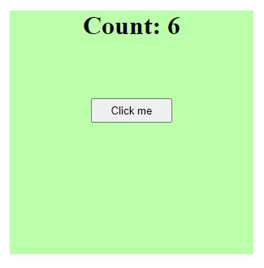

# State

示例：[../script/11-state/](../script/11-state/)



在 React 中，当组件渲染完毕后，直接修改组件内的变量并不会导致组件的重新渲染。要让组件重新渲染，需要使用一个特殊的变量`state`

**例子**：以下代码每次点击后，计数器的值会加 1，但是组件并不会重新渲染

```js
// App.js

import React from "react";
import "./App.css";

const App = () => {
  let count = 0; // 使用普通变量作为计数器的初始值

  const handleClick = () => {
    count++; // 每次点击，计数器加1
  };

  return (
    <div className="app">
      <h1>Count: {count}</h1> {/*在页面中显示变量的值*/}
      <button onClick={handleClick}>Click me</button> {/*  点击按钮后，调用handleClick函数  */}
    </div>
  );
};

export default App;
```

注意：React 并不会因为一个普通变量的改变而重新渲染组件，React 只会在state或 props 发生变化时重新渲染组件

为了让组件重新渲染，需要创建一个state变量，state相当于一个在React后台已经注册的变量，React会监控这个变量的变化，当state变化时会自动触发重新渲染。
> import {useState} from "react";

要创建state变量，需要使用钩子函数（Hooks）useState 。useState()接收一个参数，作为state的初始值。比如：useState(0)的 initial state是0）：
> useState(0)

钩子函数返回的是一个数组[initialState, fucntion]，数组中第一个元素是state的当前值，直接修改它不会引发组件的重新渲染

注意，要想修改state不能直接修改初始值（因为这样还是相当于直接修改变量），需要通过函数来修改变量的值，这样才能触发重新渲染
> 比如：const [user, setUser] = useState({name:'Jack', age:19})
> 
> 这里state变量是user， state 的初始值是{name:'Jack', age:19}，修改变量的函数是setUser

```js
// App.js

import React, { useState } from "react"; // 首先引入useState钩子函数
import "./App.css";

const App = () => {
  const [count, setCount] = useState(0); // 创建一个state变量count，初始值为0，以及一个修改count的函数setCount

  const handleClick = () => {
    setCount(count + 1);
    // 每次点击，调用setCount函数，修改count的值
    // 注意这是一个特殊函数，专门用来修改state变量的值
  };

  return (
    <div className="app">
      <h1>Count: {count}</h1>
      <button onClick={handleClick}>Click me</button>
    </div>
  );
};

export default App;
```

## 注意事项

1. 钩子函数都以`use`开头，比如`useState`、`useEffect`等 

2. `useState` 返回的是一个数组，数组的第一个元素是 state 变量，第二个元素是修改 state 变量的函数。第二个函数通常命名为`setXxx`，比如`setCount`

```js
// 这是一个解构赋值的写法
const [count, setCount] = useState(0);

// 相当于
 const result = useState(0); // 返回结果[0, function(){}]
 const count = result[0];
 const setCount = result[1];
```

3. setState()的调用并不直接修改当前的state，而是修改组件下一次渲染时的state值
4. setState()是异步的，可能导致计算错误。比如点击按钮多次非常快速，count值却没有正确更新。**最好使用回调函数形式来修改state，以避免错误**
  
    以下例子中`setCount`函数接收了一个回调函数作为其参数。当调用这个函数时，我们并没有直接提供新的值。相反，我们提供了一个函数，告诉React如何计算新的值
```js
// 错误的例子
const handler1 = () => {
    setCount(count + 1);  // 因为setCount是异步的，如果用户连续快速点击按钮，可能在count更新前再次调用了handler1，这样就可能导致count值没有正确地每次都增加1

// 正确的例子
const handler1 = () => {
    setCount(prevCount => prevCount + 1);  // 当setCount调用这个函数时，我们告诉React：请你查看count的当前值，将其命名为prevCount，然后为我计算prevCount + 1作为新的值
}
```
5. 用展开语法来继承原始对象的属性，这样可以只改变对象的其中一个属性，剩余的不变
```js
// Spread syntax
let arr1 = [1, 2, 3];
let arr2 = [...arr1, 4, 5]; // [1, 2, 3, 4, 5]
```
```js
const [user, setUser] = useState({ name: 'Jack', age: 19 });
const handler2 = () => 
{
    // setUser({ name: 'Mark'}) // 这样修改的话名字会变，但是age会直接消失
    setUser({ ...user, name: 'Mark' }); // 只修改其中一个变量name, age保持不变
}

return (
    <div className="app">
        <h1>{user.name} -- {user.age} </h1>
        <button onClick={handler2}>Click Me</button>
    </div>
);

```