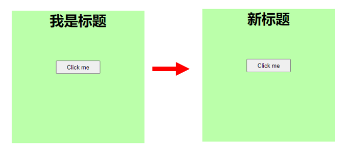

# 获取原生的 DOM 对象

示例：[../script/12-DOM-access-and-useRef/](../script/12-DOM-access-and-useRef/)



在 React 中有两种方法获取 DOM 对象：

#### 1. 使用传统的`document` ，直接对 DOM 进行操作(不推荐)

```js
const App = () => {
  const clickHandler = () => {
    const title = document.getElementById("title");
    title.innerHTML = "新标题"; // 通过id获取h1元素，并修改其内容
  };

  return (
    <div className="app">
      <h1 id="title">我是标题</h1> {/*  给h1元素设置id */}
      <button onClick={clickHandler}>Click me</button>
      {/*  点击按钮后，调用handler1函数  */}
    </div>
  );
};
export default App;
```

#### 2. 直接从 React 获取 DOM 对象

1.  创建一个存储 DOM 对象的容器 - 使用 `useRef()` 钩子（Hook）函数来创建容器
    ```js
    const xxx = useRef(null); // 创建一个ref对象
    ```
2.  将容器设置为想要获取 DOM 对象元素的`ref`属性

    ```js
    <h1 ref={xxx}>Hello World!</h1>
    ```

    这样，当组件渲染后，xxx.current 将直接指向这个 `<h1>`的 DOM 对象 

    例子：

    ```js
    /*注意：
    * 1. 钩子（Hook）函数只能在函数组件或自定义钩子中使用，不能在类组件中使用
    * 2. 钩子函数只能直接在函数组件中调用
    *    比如以下例子中钩子可以在App组件中调用，但是不能在clickHandler函数中调用，因为clickHandler是嵌套在App组件中的
    */

    import React, { useRef } from "react"; // 首先引入useRef钩子函数

    const App = () => {
      const titleRef = useRef(); // 使用useRef钩子函数创建了一个ref对象，命名为titleRef。这个对象将用于引用DOM元素

      const clickHandler = () => { // 定义了一个函数clickHandler，这个函数将在按钮被点击时执行
        titleRef.current.innerHTML = "新标题"; 
        // 修改了通过titleRef引用的DOM元素（在这种情况下，是<h1>元素）的内容，将其内容设置为“新标题”

      return (
        <div className="app">
          <h1 ref={titleRef}>我是标题</h1>
          {/*  创建一个<h1>元素，并将之前创建的`titleRef` ref对象赋值给该元素的ref属性。这样，我们就可以通过titleRef引用这个<h1>元素 */}
          <button onClick={clickHandler}>Click me</button>
          {/*  点击按钮后，调用handler1函数  */}
        </div>
      );
    };
    export default App;
    ```

# useRef()

- useRef() 钩子函数返回的是一个普通的 JS 对象，这个对象的 current 属性指向我们传给 useRef() 的初始值（如果没有传初始值，则为 undefined）
  ```js
  const titleRef = useRef(); // {current:undefined}
  // 相当于
  const titleRef = { current: undefined }; // 直接创建一个JS对象也可以代替useRef()，但有以下区别：
  // 1. 我们自己创建的对象，每次组件重新渲染时都会创建一个新的对象
  // 2. useRef()创建的对象，可以确保每次渲染获取到的都是同一个对象
  // 3. 当你需要一个对象不会因为组件的重新渲染而改变时，可以使用 useRef()
  ```

